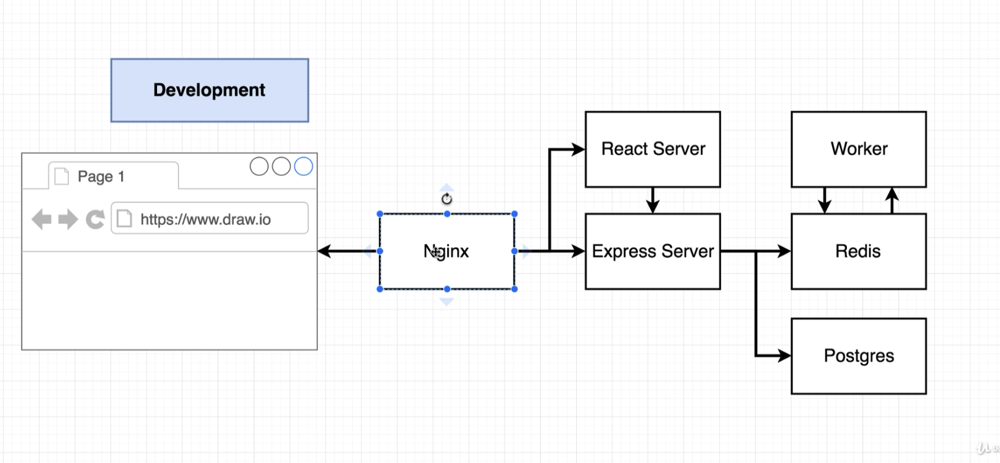
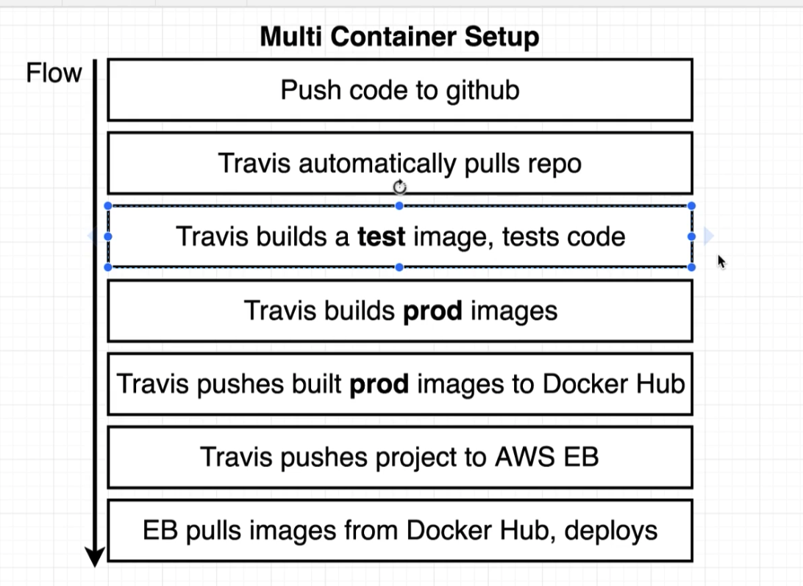

# Single Container Deployment Issues

1. The app was simple - no outside dependencies
2. Our image was built multiple times
3. How do we connect to a database from a container?

# Nginx

- if req start with /api, redirect to Express Server
- else redirect to React Server

"default.conf"

- Adds configuration rules to Nginx

1. Tell Nginx there is an 'upstream' server at client:3000
2. Tell Nginx there is an 'upstream' server at server:5001
3. Listen on port 80
4. '/' send to client, '/api' send to server

